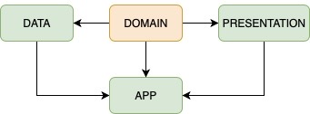
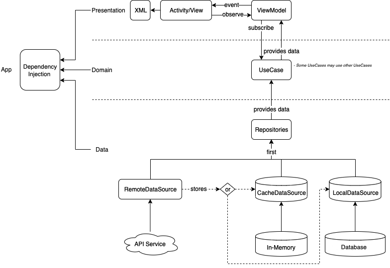

# Walkify

## Configuration
To configure the project in your machine you will only have to clone the project repository,
[create an Flickr API key](https://www.flickr.com/services/apps/create/) and replace it in the file `apikey.properties`.

## Modules distribution

  

### Data Module

_RemoteDataSource_

- <b> Role </b>
	- Constructing the request data
	- Fetching data from a service (Retrofit)
	- Handling the HTTP result and modify the `Single` if is necessary (specific error code return or error reason)
	- Map *Data* objects to *Domain* objects
- <b>Dependencies</b>
	- API service (Retrofit)
- <b>Input</b>
	- API request parameters
- <b> Output </b>
	- `Single<DomainObject>`
	- `Completable`

_LocalDataSource_

- <b>Role</b>
	- Storing / fetching data on disk
	- Map *Data* objects to *Domain* objects
  - Clear database
- <b>Dependencies</b>
	- [Room](https://developer.android.com/topic/libraries/architecture/room?gclid=EAIaIQobChMIpK2Hsbau6AIVR0TTCh3WoAvhEAAYASAAEgJeWPD_BwE)
- <b>Input</b>
	- Data to save
	- Id for data retrieving 
- <b>Output</b>
	- `Single<DomainObject>`
	- `Observable<List<DomainObject>>`
  - `Completable`

_AndroidLocationProvider_

- <b>Role</b>
	- Fetching location updates
- <b>Dependencies</b>
	- Android context (optional)
	- `FusedLocationProvider`
- <b>Input </b>
	- Smallest displacement in meters
- <b>Output</b>
	- Observable<GpsLocation>

_Repository_

- <b>Role</b>
	- Fetching and storing data
	- Connect to different `DataSources` and make the decision from where to fetch the data
- <b> Dependencies </b>
	- `RemoteDataSource` and/or `LocalCacheDataSource`
- <b>Input </b>
	- Data retrieving with Id
	- Data saving \<T>
	- Data for HTTP request
- <b> Output </b>
	- `Observable<DomainObject>`
	- `Completable`
	- `Single<DomainObject>`

### Domain Module
_UseCase_

- <b>Role</b>
	- Processing data based on business logic
	- Single task responsibility
  - Concat with other use cases to make more complex business logic
- <b>Dependencies</b>
	- Repositories 
	- UseCases (optional)
- <b>Input</b>
	- Param classes
- <b>Output</b>
	- `Single<DomainObject>`
	- `Observable<DomainObject>`
	- `Completable<DomainObject>`

### Presentation Module
_ViewModel_

- <b>Role</b>
	- Expose data to be displayed to the UI
	- Trigger actions on UseCases based on user actions
	- Subscribe and dispose observables
- <b>Dependencies</b>
	- UseCases
- <b> Input </b>
	- Id's
	- User actions
- <b> Output </b>
	- `LiveData<DomainModel or UIModel>`

_Views_

- <b>Role</b>
	- Display data to the user
- <b>Dependencies</b>
	- `ViewModels`
- <b>Input</b>
- <b>Output</b>

### App Module
_Dependency Injection_

- <b>Role</b>
	- Implement dependency injection for the app
- <b>Dependencies</b>
	- Dagger2

## Architecture

  

I'm following Clean Architecture principles to keep everything encapsulated, easily testable and not framework / library dependent.

[Mockito]("https://medium.com/@jamparan/the-relation-between-mockito-and-junit-376ca8a1095f") is beign used for tests.

## Dependency Injection
The dependency injection is implemented with [Dagger2](https://github.com/google/dagger/), located in the *app* module.

All Dagger modules are separated by the modules that the app is made of, data and presentation. Domain doesn't need any Dagger Module. 

## Unit testing

We only have unit tests for `domain` and `data` (for now 😅) so we use `Mockito` and `.test()`, method from RxJava framework, to make all the tests.

For the tests I'm following the <b>AAA pattern</b> (Arrange, Act, Assert), more info in this [medium post](https://medium.com/@pjbgf/title-testing-code-ocd-and-the-aaa-pattern-df453975ab80).

## Contributors

@mapm14 - mapm14@gmail.com
